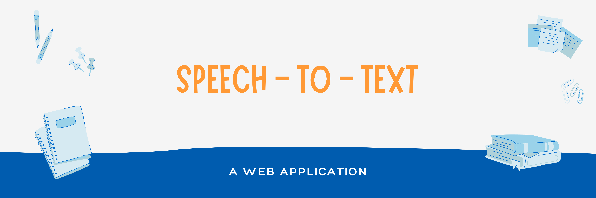

<h2> 🤖 SPEECH TO TEXT </h2>
Basically, The <a href="https://ajaiqmar.github.io/SPEECH-TO-TEXT/">Speech To Text</a> 🤖 Application is a Web application which is built on Annyang JS library. Just a Speech To Text converter which just carries out a task when a specific command is pre-defined and associated with it. Say "open google" after opening the <a href="https://ajaiqmar.github.io/SPEECH-TO-TEXT/">Application</a>.

<h2> 📱 TECHNOLOGY STACK </h2>

